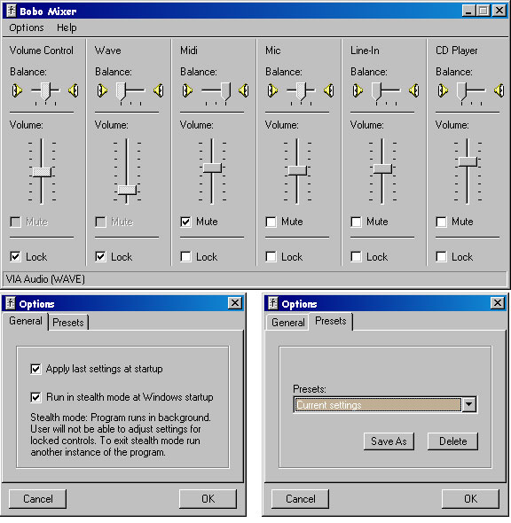



## Bobo Mixer

### Description

Mixer API demo. A clone of the Windows Mixer(sndvol32.exe). Volume/Balance/Mute controls fully responsive to external changes via callbacks from winmm.dll.

The Mixer API causes problems for VB coders everywhere. The tangled web Microsoft created turns what should be simple into a nightmare. In this demo I try to untangle some of this mess by cloning the Windows Mixer(sndvol32.exe) as an example of how to write your own Volume/Balance/Mute controls. As an App it's pretty useless as sndvol32.exe exists on all Windows platforms, but for all those Audio/MP3 coders out there, it should make life a little easier.

Update:

As requested an "Administrator" version(Included as a separate zip)

Added:

1. The ability to lock Volume,Balance and Mute for each control

2. Save settings as presets

3. Run hidden - simple code - not 100% hidden, but good enough to keep

the average user out.

The save settings demonstrates writing settings to a binary file, something not often seen here on PSC.

What it will do: If a control is locked, not even sndvol32.exe can make changes. The given control

cannot be altered.

Security is low - I'll leave it up to you to bump up the security level.

What it wont do: If a 3rd party App communicates directly with the soundcard(WinAmp for example)

it can effect changes.

Screenshot shows "Administrator" version
 
### More Info
 

             |
---                |---
**Submitted On**   |2002-09-03 01:15:12
**By**             |[MrBobo](https://github.com/Planet-Source-Code/PSCIndex/blob/master/ByAuthor/mrbobo.md)
**Level**          |Advanced
**User Rating**    |4.4 (71 globes from 16 users)
**Compatibility**  |VB 6\.0
**Category**       |[Windows API Call/ Explanation](https://github.com/Planet-Source-Code/PSCIndex/blob/master/ByCategory/windows-api-call-explanation__1-39.md)
**World**          |[Visual Basic](https://github.com/Planet-Source-Code/PSCIndex/blob/master/ByWorld/visual-basic.md)
**Archive File**   |[Bobo\_Mixer126340942002\.zip](https://github.com/Planet-Source-Code/mrbobo-bobo-mixer__1-38589/archive/master.zip)

